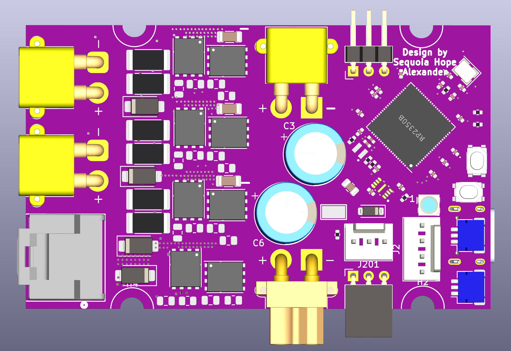
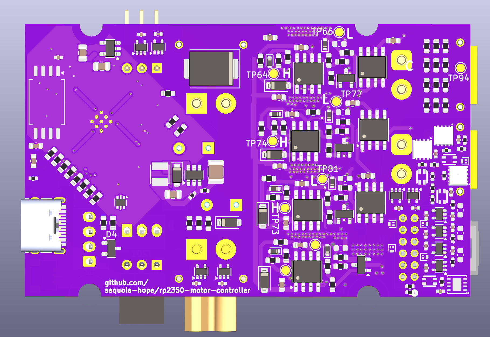

# rp2350-motor-controller

---- work in progress ----

This board is open source.

Design by Sequoia Hope Alexander. 

I want to build tools that help people get what they need. 

Follow me on Bluesky:
    https://bsky.app/profile/sequoia.farm

CERN-OHL-P license. See LICENSE file for details.

A brushless motor controller and servomotor controller for robotics.

This board is designed to be fabricated at JLCPCB by anyone. All of the
components have been sourced to be in stock in high volumes and low cost
at LCSC/JLCPCB. When the board is ready, you can order them yourself at cost
by uploading a zip file to JLCPCB for under $50 per board QTY 10.

Board features:
 - Dual core 150MHz RP2350B CPU with floating point and excellent firmware APIs
 - Four independent software-controlled half-h bridges
 - Supports brushless motors, stepper motors, or two brushed motors.
 - SimpleFOC firmware support
 - Maximum 60 volts, 20 Amps (possibly more current depending on copper thickness and thermals)
 - 80 volt 50+ amp Infineon FETS
 - Phase voltage sensing for three phases
 - Phase current sensing for three phases
 - Input voltage sensing
 - Temperature sensing for both the FETS and motor.
 - Isolated CAN bus port
 - USB-C can be used for Micropython development, USB serial, or gamepad emulation for force feedback wheels or other devices.
 - Advanced 12-pin encoder port
    - Active signal switching reroutes physical I/O pins to multiple signal conditioning circuits.
    - Four bidirectional differential line drivers with common mode filters
    - Switchable filtering for single ended hall sensor support
    - Support for single ended or differential SPI or quadrature encoders
    - Dual channel analog encoder support for sin/cos or linear analog sensors
    - I2C sensor support
    - Switchable encoder output voltage - 3.3v or 5v - so nearly any sensor can easily be connected
    - Unused line drivers can be used as additional high speed bidirectional comms.
 - All configuration happens in software, no jumpers needed. 
 - Expandable emergency stop circuit
 - Phase and encoder leads on one side of the board, data connectors on the other
    - It is possible to design a PCB which mates to both the phase and encoder leads, to make connector adapter PCBs to your preferred motor and encoder PCBs.
 - Boards can be daisy-chained side to side, passing motor power and data via serial.
 
Additionally:
 ---
 - No special programmer is required, no bootloader needs to be flashed.
 - Supports the Raspberry Pi debugger board, or use the compatible custom debugger board which can be fabbed at JLCPCB as well.
    - https://github.com/sequoia-hope/rp2040-motor-controller/tree/main/debugger
 - PlatformIO and VSCode support with step debugging, breakpoints, memory and register views.
 
 
-------

